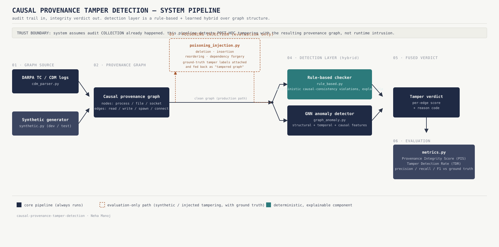

# causal-provenance-tamper-detection

## Reference Papers
1. https://www.sciencedirect.com/science/article/pii/S1389128625007728
2. https://arxiv.org/pdf/2508.21323v2
3. https://www.usenix.org/legacy/event/tapp11/tech/final_files/Meliou.pdf


# Causal Provenance Tamper Detection

Detecting poisoning of system provenance graphs (audit-log-derived evidence) by checking whether the graph's causal structure is still internally consistent.



## Problem statement

When an incident responder reconstructs an attack timeline, the primary evidence is a provenance graph built from system audit logs: which process spawned which, what read or wrote which file, what connected to what, in what order. A large body of recent work (Kairos, MAGIC, ORTHRUS, FLASH, PROGRAPHER, R-CAID, and others) builds increasingly capable detectors on top of that graph. Nearly all of them share the same starting assumption: the graph itself is trustworthy. Kairos states this outright, assuming the integrity of the provenance graph and pointing to secure logging as someone else's problem to solve. MAGIC excludes poison attacks from its threat model entirely.

That assumption breaks the moment an attacker has the privileges needed to carry out the attack in the first place. An adversary with root or with write access to the log store can delete the events that implicate them, insert fabricated events to misdirect the investigation, reorder events to break the causal story, or forge dependency edges to reattach their activity to an innocent process. None of the detectors built on top of the graph will notice, because they were never designed to ask whether the graph is real.

This project sits underneath that layer. It doesn't try to detect malicious behavior recorded in the graph. It tries to detect whether the graph has been tampered with after the fact, by checking whether its causal structure, the "who spawned what, what read or wrote what, in what order" logic, is still internally consistent.

## The idea

A causally valid provenance graph obeys constraints that tampering tends to break even when the attacker is careful: a process can't write to a file before it opens it, a child process can't have a spawn timestamp earlier than its parent's, a file can't be read by a process that was never causally connected to whatever wrote it, event ordering along a causal chain has to be monotonic. Deleting, inserting, reordering, or forging edges in a graph while preserving every one of these constraints simultaneously is much harder than tampering with a flat log, because the tamper has to be globally consistent, not just locally plausible.

The approach is a hybrid of two detectors that both operate on the same graph:

- A deterministic, rule-based causal-consistency checker that flags hard violations of these constraints directly, with an explainable, human-readable reason for every flag.
- A graph neural network trained on clean provenance graphs that scores subtler tampering the hard rules don't catch: statistically anomalous structure, timing, or dependency patterns that are still technically "consistent" but don't look like anything the model has seen in genuine system behavior.

The two are fused into a single per-edge tamper score. The rule-based layer gives reviewers something they can audit and trust; the learned layer gives coverage against attackers sophisticated enough to stay just inside the deterministic rules.

## Why this is a gap worth filling

This isn't a hypothetical concern the field hasn't noticed, it's one it has explicitly acknowledged and left for someone else. Provenance-based intrusion detection has had a steady stream of top-tier work over the last few years (Kairos at S&P '24, MAGIC and PROGRAPHER at USENIX Sec, ORTHRUS at USENIX Sec '25, R-CAID and FLASH at S&P '24), and the honest ones say plainly that they assume the input graph is uncorrupted. This project is the layer those systems are implicitly relying on but nobody in that line of work has built and evaluated directly against realistic, causally-aware tampering.

## Scope

In scope: provenance graph construction from real audit data, poisoning attack simulation with ground truth, and detection of that poisoning via causal consistency plus learned anomaly scoring.

Out of scope, and part of a separate, larger system this project feeds into: post-quantum signing of provenance records, Merkle-tree anchoring for tamper-evidence at capture time, and risk-adaptive tiering of what gets logged. Those live one layer below this one (preventing/proving tampering at the point of capture, rather than detecting it after the fact in an already-collected graph).

## Full workflow, end to end

1. **Acquire real audit data.** Download the DARPA Transparent Computing Engagement 3 dataset (see Dataset section below). This is the ground-truth source of real system audit logs with labeled attack activity.
2. **Parse into a provenance graph.** Run `src/graph_construction/cdm_parser.py` against the downloaded CDM (Common Data Model) Avro records to build a directed causal graph: nodes are subjects and objects (processes, files, sockets), edges are the causal relations between them (spawn, read, write, connect), each with a timestamp.
3. **(Development/testing only) Generate synthetic graphs.** `src/graph_construction/synthetic.py` produces graphs with the same schema for fast iteration without needing the real dataset on hand. Any numbers produced this way are for pipeline validation only and are never reported as detection performance.
4. **Establish a clean baseline.** Hold out a known-good graph (or subgraph) with no tampering, this is what the anomaly detector is trained on and what later results are compared against.
5. **Inject labeled poisoning attacks, for evaluation.** `src/detection/poisoning_injection.py` applies deletion, insertion, reordering, and dependency-forgery attacks to a copy of the graph, recording ground-truth labels for every tampered edge. This step exists purely to create a labeled evaluation set, it never runs in a real deployment scenario, where you don't know in advance what's been tampered with.
6. **Run the rule-based causal-consistency checker.** `src/detection/rule_based.py` walks the graph and flags edges that violate deterministic causal constraints (timestamp ordering, dependency validity, structural well-formedness), each flag comes with a specific violated rule as its reason code.
7. **Run the GNN anomaly detector.** `src/detection/graph_anomaly.py` scores every edge for how anomalous it looks relative to the clean-graph training distribution, catching tampering that's locally consistent but structurally or temporally out of place.
8. **Fuse the two signals.** Combine rule-based flags and anomaly scores into one per-edge verdict, with the rule-based reason code preserved wherever it fired, so every flagged edge has a human-readable justification, not just a black-box score.
9. **Evaluate against ground truth.** `src/eval/metrics.py` compares fused verdicts to the labels from step 5 and reports Provenance Integrity Score (PIS), Tamper Detection Rate (TDR), precision, recall, and F1, at both the graph and edge level.
10. **Stress-test against an adaptive attacker.** Repeat steps 5 through 9 with a "smart" injector that specifically minimizes its own causal-consistency signature (targeted, low-volume, dependency-preserving edits) rather than naive random tampering, this is the result that differentiates the paper from a routine detection exercise.
11. **Compare against literature baselines.** Reproduce or approximate at least one adapted baseline from prior provenance-detection work to anchor the comparison table externally, not just internally between your own two detectors.
12. **Write up and package for artifact evaluation.** Clean the repo to a single-command reproduction path, document exact dependency versions, and prepare the Open Science / artifact appendix required by USENIX.

## Repository layout

```
src/graph_construction/   schema, CDM parser, synthetic graph generator
src/detection/            poisoning injection, rule-based + anomaly detection
src/eval/                 PIS/TDR/precision/recall metrics
tests/                    unit tests for all of the above
scripts/                  data download utility
notebooks/                exploratory analysis
docs/                     write-up notes and figures, not the paper itself
data/                     dataset (not included, see below)
```

## Dataset

This repo does not include the dataset, it's too large to distribute in a git repo and DARPA releases it separately.

**Source.** The data is DARPA's Transparent Computing (TC) program, Engagement 3, publicly released for research use. Official release repo and manifest:

```
https://github.com/darpa-i2o/Transparent-Computing/blob/master/README-E3.md
```

**Download steps.**

1. Read `README-E3.md` in the link above, it documents the full file manifest, the CDM schema, and which topics contain the cleanest data.
2. Because of its size, the actual data is hosted on Google Drive by Five Directions Inc., linked from that README (`drive.google.com/open?id=1QlbUFWAGq3Hpl8wVdzOdIoZLFxkII4EK` at time of writing, confirm against the current README since links occasionally move). This is a manual download, there's no API or script that automates it.
3. Under `data/theia/` in that Drive folder, pull the "good data" topics specifically called out in the manifest: `ta1-theia-e3-official-1r`, `ta1-theia-e3-official-3`, `ta1-theia-e3-official-5m`, `ta1-theia-e3-official-6r`. Avoid topics not on this list, some are documented as missing records or otherwise unreliable.
4. Also pull `schema/TCCDMDatum.avsc` (machine-readable Avro schema), `schema/CDM18.avdl` and `schema/cdm.pdf` (human-readable schema docs), and `ground truth/tc_ground_truth_report_e3_update.pdf` (labeled attack activity for the engagement). You'll need the schema to sanity-check `cdm_parser.py` field assumptions, and the ground truth report to validate detection results against real, documented attacks rather than only synthetic ones.
5. The raw files are Avro binaries. DARPA's release includes a Java consumer (`tools/ta3-java-consumer.tar.gz`, requires Java 8 and Maven) that can parse them and dump to JSON if you want a human-readable intermediate format before writing your own Python parser logic in `cdm_parser.py`.
6. Place the downloaded files under `data/` locally (this path is gitignored, keep it that way, don't commit raw audit data to the repo).

**A note on validity.** DARPA's own README says this data was produced by research prototypes and is "practically guaranteed to be imperfect." Expect to spend real time on data-quality issues (schema drift, malformed records, UUID quirks) before trusting any parsed output, and document what you find, since that documentation is itself evidence of rigor in the eventual paper.

## Running it

```
pip install -r requirements.txt
python3 -m src.run_pipeline
```

This generates two synthetic graphs (clean baseline and one to poison), injects labeled poisoning events across all four attack types, runs both detectors, and prints a PIS/TDR/precision report per detector and combined. Swap in real parsed graphs from `cdm_parser.py` once the dataset is downloaded to get results that can actually be reported.

## Tests

```
python3 -m unittest discover -s tests -v
```

## Current state

This pipeline runs end to end on synthetic data only. Two things are explicitly not done yet: the CDM parser has never been run against real Theia data, and the anomaly detector is an IsolationForest baseline standing in for the GraphSAGE model in the original proposal. See `docs/` for the detailed roadmap from here to a USENIX-ready evaluation.

## Reference papers

- Kairos: Practical Intrusion Detection and Investigation using Whole-system Provenance, IEEE S&P 2024
- MAGIC: Detecting Advanced Persistent Threats via Masked Graph Representation Learning, USENIX Security 2024
- ORTHRUS: Achieving High Quality of Attribution in Provenance-based Intrusion Detection Systems, USENIX Security 2025
- Meliou et al., Tracing Data Errors with View-Conditioned Causality, USENIX TaPP 2011
